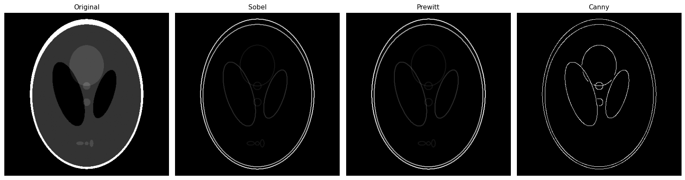
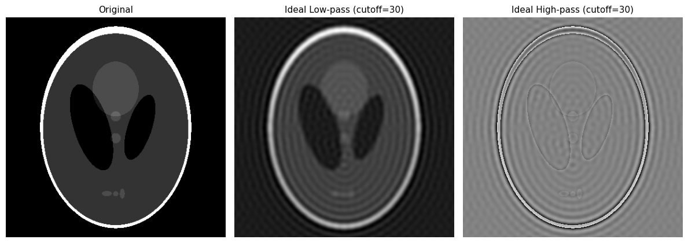
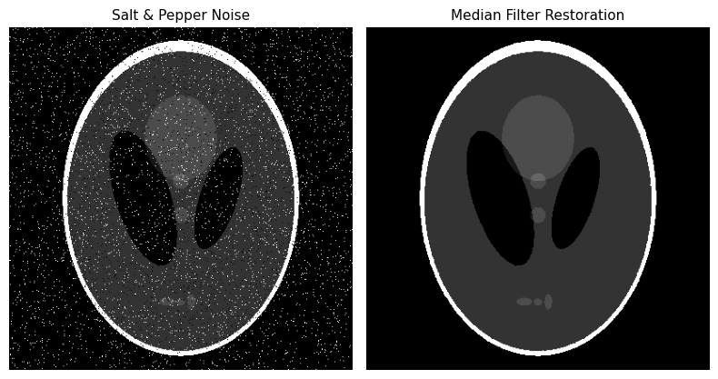
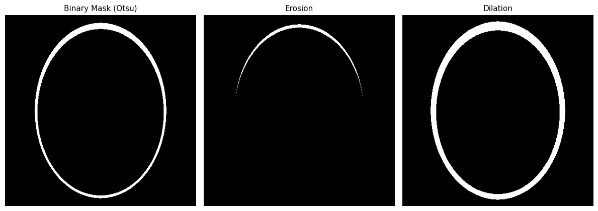
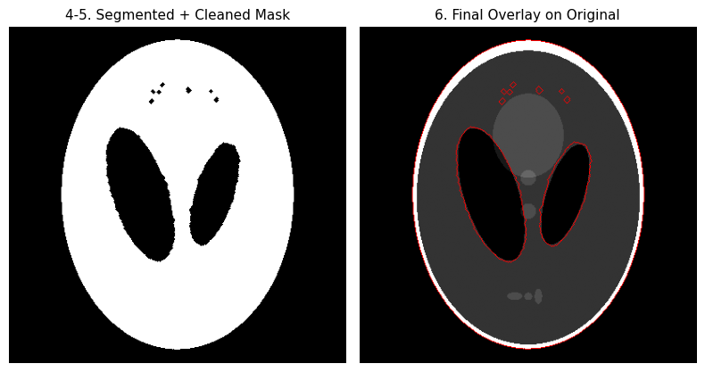

# Digital Image Processing Toolkit

A hands-on Digital Image Processing project covering the full pipeline — from raw pixels to
segmented regions of interest — built with Python, OpenCV, and scikit-image. Works on **both**
general images and medical images (MRI/microscopy), so it doubles as a general DIP demo and a
biomedical imaging mini-project.

Available in two forms:
- **Jupyter notebook** (`notebooks/dip_toolkit.ipynb`) — fully executed, with explanations, great for reading through on GitHub
- **Streamlit app** (`streamlit_app/app.py`) — interactive, upload your own image and tune parameters live

## Techniques Covered

| Category | Techniques |
|---|---|
| Fundamentals | Grayscale conversion, histograms, global histogram equalization, CLAHE |
| Spatial Filtering | Mean / Gaussian / median smoothing, unsharp masking, Laplacian sharpening, Sobel, Prewitt, Canny edge detection |
| Frequency Domain | 2D FFT magnitude spectrum, ideal low-pass & high-pass filtering |
| Noise & Restoration | Gaussian / salt-and-pepper / speckle noise simulation, Wiener filter, median filter, Non-Local Means denoising |
| Morphology | Erosion, dilation, opening, closing, boundary extraction |
| Segmentation | Otsu thresholding, Canny + hole filling, K-means clustering, watershed, region-property filtering (area/eccentricity) |
| Pipeline | End-to-end: noisy input → denoise → contrast-enhance → segment → morphological cleanup → overlay |

## Sample Outputs

**Edge Detection** (Sobel / Prewitt / Canny)


**Frequency Domain Filtering** (Ideal Low-pass & High-pass via 2D FFT)


**Noise Restoration** (Salt & Pepper noise → Median filter)


**Segmentation** (Otsu / Canny+Fill / K-Means / Watershed)


**Full Pipeline Result** (Denoise → Enhance → Segment → Overlay)


## Getting Started

### Option A — Notebook

```bash
pip install -r requirements.txt
jupyter notebook notebooks/dip_toolkit.ipynb
```

The notebook defaults to a built-in Shepp-Logan MRI phantom. To run it on your own image, set
`IMAGE_PATH` in the second cell to a file on disk (X-ray, MRI slice, or any photo).

### Option B — Streamlit App (interactive demo)

```bash
pip install -r requirements.txt
streamlit run streamlit_app/app.py
```

Upload any image from the sidebar, pick a processing category, and tune parameters live with sliders.

## Project Structure

```
dip-toolkit/
├── README.md
├── requirements.txt
├── images/                     # sample output thumbnails used in this README
├── notebooks/
│   └── dip_toolkit.ipynb       # full walkthrough notebook, pre-executed
└── streamlit_app/
    └── app.py                  # interactive web demo
```

## Why This Project

Built to demonstrate practical command of core Digital Image Processing concepts — spatial and
frequency-domain filtering, noise modeling and restoration, morphological processing, and
multi-method segmentation — applied in a way that mirrors a real biomedical image analysis
workflow (e.g. denoising a scan, enhancing contrast, segmenting a region of interest, and
cleaning up the resulting mask before measurement).

## Author

Debebe Nigatu — Biomedical Engineering, Addis Ababa University (AAiT)
